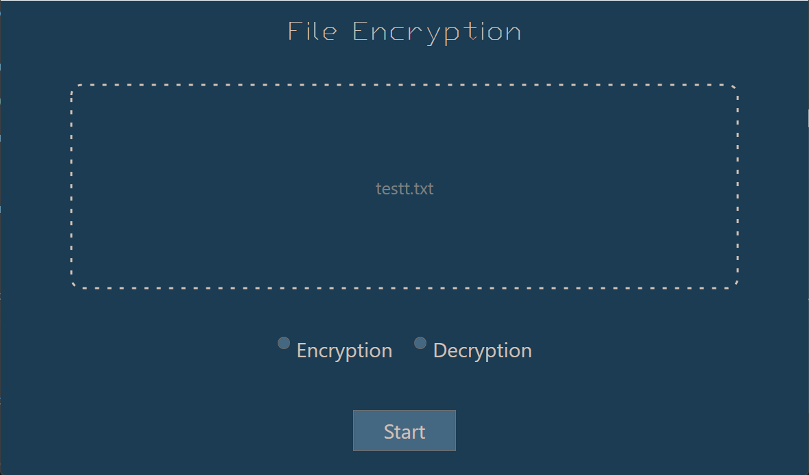

# 🔐 File Encryption Tool

Simple WPF desktop application for encrypting and decrypting files using Windows EFS (Encrypting File System).

 

## 📌 About This Project

This is an **educational/portfolio project** created to learn:
- WPF application development
- File handling in C#
- Drag & drop functionality
- Windows encryption features

## ⚠️ Important Limitations

**This tool uses Windows EFS, which has significant limitations:**

- ✅ Encrypts files locally on your computer
- ❌ **Files are NOT protected when transferred/shared** (Messenger, email, etc.)
- ❌ Works ONLY on NTFS file systems (not FAT32/exFAT)
- ❌ Encryption is tied to your Windows user account
- ❌ Does NOT work on Windows Home Edition
- ❌ No password protection

**For real file encryption for sharing, consider using AES encryption instead.**

## 🚀 Features

- Drag & drop multiple files
- Encrypt/decrypt files with one click
- Simple and clean user interface
- Success/failure feedback
- Input validation

## 💻 Requirements

- Windows 10/11 (Pro/Enterprise/Education)
- .NET Framework 4.7.2 or higher
- NTFS file system

## 📖 How to Use

1. Launch the application
2. Select **Encryption** or **Decryption** mode
3. Drag and drop files into the drop zone
4. Click **Start** button
5. Check the results

## 🛠️ Technologies Used

- C# 
- WPF (Windows Presentation Foundation)
- .NET Framework
- Windows EFS API

## 📚 What I Learned

- Creating responsive WPF interfaces
- Implementing drag & drop functionality
- File I/O operations in C#
- Exception handling and validation
- Windows file system encryption basics